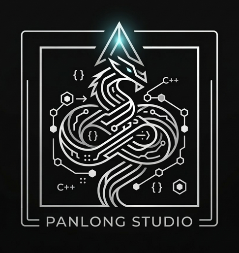

  

  
# 攀龙署 | Panlong Studio

*追求极致性能，构建稳固架构。*

---

## 🐲 关于我们 (About Us)
攀龙署由六名开发者组成，专注于底层技术研发与高性能微服务架构实践。我们致力于通过 C++ 工程化手段，解决分布式系统中的高并发挑战。

## 🛠 技术核心 (Technical Stack)
我们的研发基石涵盖以下领域：

* **语言标准**: C++11
* **核心基建**: 高并发网络编程 (Epoll/Reactor)、异步 IO
* **通信协议**: gRPC / Protobuf
* **数据存储**: MySQL 优化、Redis 缓存设计
* **工程构建**: CMake 自动化构建与性能分析

## 🚀 核心项目 (Core Projects)
* updating: 
  一套模块化、解耦的微服务底层框架，专为低延迟业务场景设计。

## 🤝 协作建议 (Join Us)
我们始终保持小规模、高频次的协作模式。如果您对底层技术探讨感兴趣，欢迎：
- 通过 **Issue** 讨论架构细节。
- 提交 **Pull Request** 参与功能迭代。

*注：我们重视代码质量与技术文档的完整性，在此基础上鼓励任何建设性的贡献。*

---

  
© 2026 Panlong Studio. All Rights Reserved.

